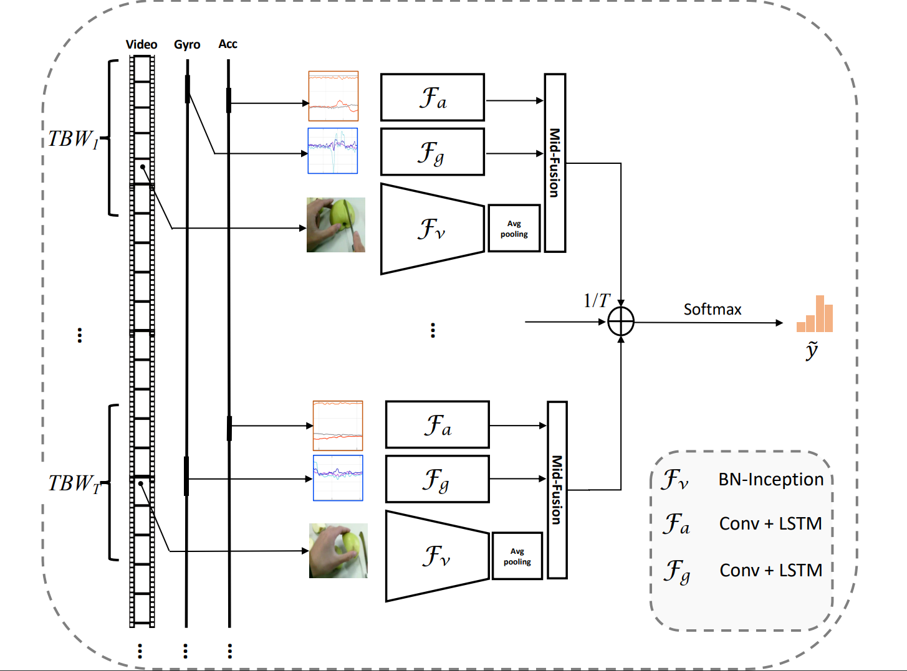

# uestc-mmea-cl
for the dataset uestc-mmea-cl
# uestc-mmea-cl -- the new multi-modal activity dataset for continual egocentric activity recognition
<div align="center">
  
</div>

## Introduction  
_UESTC-MMEA-CL_ is a new multi-modal activity dataset for continual egocentric activity recognition, which is proposed to promote future studies on continual learning for first-person activity recognition in wearable applications. Our dataset provides not only vision data with auxiliary inertial sensor data but also comprehensive and complex daily activity categories for the purpose of continual learning research. UESTC-MMEA-CL comprises 30.4 hours of fully synchronized first-person video clips, acceleration stream and gyroscope data in total. There are 32 activity classes in the dataset and each class contains approximately 200 samples. We divide the samples of each class into the training set, validation set and test set according to the ratio of 7:2:1.

_Our work in the dataset publication paper is mainly based on [_TBN_](https://github.com/ekazakos/temporal-binding-network) and _PyCIL_ toolbox. It provides a baseline of multimodal continuous learning based on this dataset._

## Installation
* Python 3.6+
* PyTorch 1.7
* CUDA 11.0 (If you build PyTorch from source, CUDA 9.0 is also compatible)
* GCC 5+


1. Clone the repository and then install it

2. Before using our program, make sure that the required environment is configured on your host！
   you can see the required packages list in the file [_requirements_](https://github.com/Tflowers-0129/uestc-mmea-cl/blob/main/requirements.txt). 
   just run the code follow can help you to build the required environment：
     ```
     conda install --yes --file requirements.txt 
     ```
 
3. If you want to download the dataset [_UESTC-MMEA-CL_](https://ivipclab.github.io/publication_uestc-mmea-cl/mmea-cl/), Please click this hyperlink. Please ensure that it is used for educational or non-commercial purposes！

    The composition of the dataset is as follows:

    ```
    UESTC-MMEA-CL/
          ├── train.txt
          ├── val.txt
          ├── test.txt
          ├── video/
          │  ├── 1_upstairs/
          │  ├──  ...
          │  └── 32_watch_TV/
          └── sensor/
              ├── 1_upstairs/
              ├──  ...
              └── 32_watch_TV/
    
    ```
4. Data preprocessing:
   The training pictures needs to be extracted in the video, and the frame extraction program is in this [hyperlink](https://github.com/ivipclab/Frame-extractor
), please run it according to the instructions. 
   In addition, we first performed ACC data/acc_rate, GYRO data/gyro_rate for sensor data, and because the sensor data has outliers, we chose a median filter with a kernel of 5 for filtering, there is zero drift in the gyroscope data, and dedrifting is also performed.


5. Pretrain Models: 
   You can modify load_from in corresponding config file to change the pretrained models.
    ```
    
    ```
## Train  

Assume that you have activated your virtual environment the code run needed, and with the dataset UESTC-MMEA-CL in path that  'data/....'. In the train process, we use 2GPUs.

Before training, modify the specific parameters you want to train in the train.sh file, of course, you also can  for example:
```
python main.py mydataset RGB Flow STFT STFT_2 --config ./exps/myewc.json --train_list mydataset_train.txt --val_list mydataset_test.txt --mpu_path '/home/amax/Downloads/whx/temporal-binding-network/dataset/gyro/' --arch BNInception --num_segments 8 --dropout 0.5 --epochs 20 -b 8 --lr 0.001 --lr_steps 10 20 --gd 20 --partialbn -j 8

```
After modifying the parameters, you only need to run the following code 
```
sh train.sh
```

## Inference


## Performance and Trained Models
The performance and trained models will be released soon, please wait...
## Acknowledgement
Thanks UESTC-MMEA-CL team for the wonderful open source project!

## Citition
If you find the uestc-mmea-cl dataset and code useful in your research, please consider citing:  
```
cite...


```
